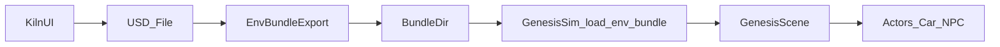

## Architecture

This page describes the major subsystems:

- UI (`kiln/ui/*`)
- Env bundles (`kiln/envio/*`)
- Genesis backend (`kiln/sim/genesis/*`)
- Actors (`kiln/actors/*`)

### High-level flow

### Design principles

- **Optional dependencies**: Genesis and USD are optional extras (`.[sim]`, `.[usd]`).
- **Version tolerance**: Genesis APIs change; the adapter uses permissive introspection.
- **Stable bundles**: USD carries geometry, `env.json` carries semantics.

