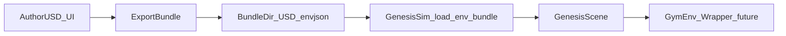

# Kiln documentation

Kiln is a studio for creating reinforcement learning environments with high-fidelity simulation.

## The main workflow

## Where to start

- If you are a user of the UI: start with **User guide → UI workflow**.
- If you want to run headless simulations: start with **User guide → Env bundles** and **Examples**.
- If you are hacking on Kiln: start with **Developer guide → Architecture**.

